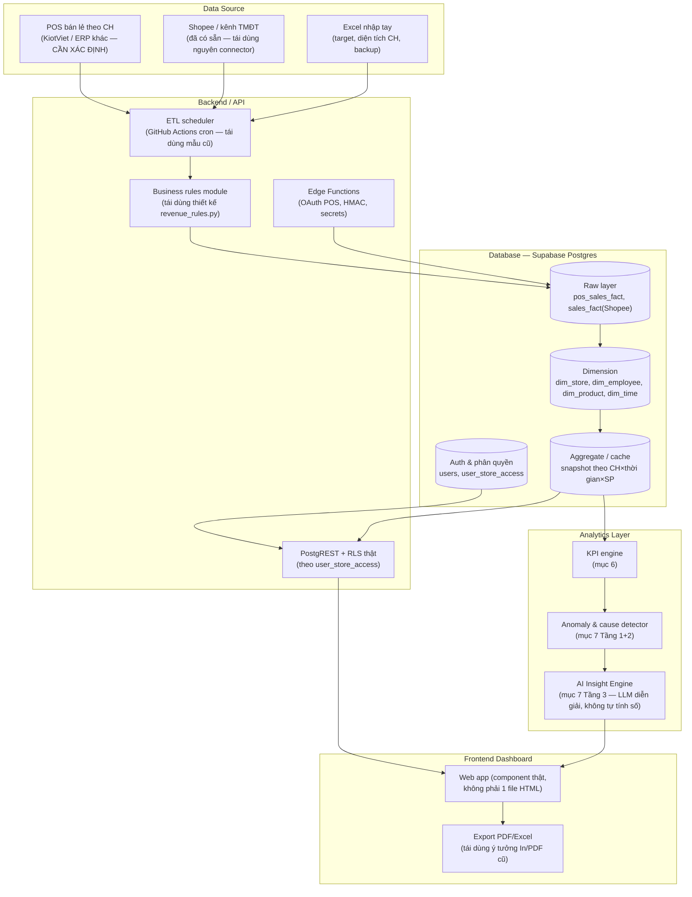

# Blueprint: Website Báo cáo & Phân tích Doanh thu Chuỗi Cửa hàng Nệm

> **Trạng thái tài liệu:** Nghiên cứu & thiết kế — CHƯA code. Đây là tài liệu gốc để Claude Code/Codex dùng ở các bước xây dựng tiếp theo.
> **Nguồn nghiên cứu:** Toàn bộ source code, schema và tài liệu nội bộ trong repo `Data App` hiện tại (Sleep Expert SKU Performance Console), đọc trực tiếp — không suy đoán.
> **Ngày viết:** 2026-08-22 · **Skill dùng để nghiên cứu/viết:** `senior-architect` (kèm tham chiếu `senior-prompt-engineer`, `ui-design-system`, `senior-backend`, `sql-database-assistant`).

---

## 0. Tóm tắt nhanh cho người đọc gấp

Dự án hiện tại **không phải** một web app có framework — nó là **1 file `index.html` (2,9 MB, 6.323 dòng) tự chứa mọi HTML/CSS/JS**, nạp dữ liệu từ **Supabase** (Postgres + PostgREST + Edge Functions Deno), được nuôi bởi một **pipeline Python chạy theo lịch qua GitHub Actions** mỗi giờ. Toàn bộ dữ liệu hiện tại đến từ **1 nguồn duy nhất: Shopee (thương mại điện tử)** — **chưa có** dữ liệu bán hàng theo **cửa hàng vật lý** hay **nhân viên bán hàng**. Đây là khoảng trống lớn nhất cần lấp khi xây site doanh thu chuỗi cửa hàng nệm (xem mục 1.7 và 11).

Điều đáng học nhất từ project hiện tại không phải là code, mà là **kỷ luật dữ liệu**: một khái niệm nghiệp vụ (doanh thu, GM%) chỉ được tính ở **đúng một nơi**, đọc dòng tiền thực tế thay vì tin nhãn trạng thái, và có hẳn một quyển "bài học" (`knowledge/LESSONS.md`) ghi lại từng lỗi từng làm sai. Kỷ luật này quan trọng hơn stack công nghệ.

---

## 1. Cấu trúc project hiện tại

### 1.1 Framework, thư viện, công nghệ

Không có `package.json`, không có `src/`, không có bundler/framework nào (React/Vue/Next đều KHÔNG được dùng). Toàn bộ frontend là **vanilla HTML/CSS/JS** viết tay, tối ưu để chạy trực tiếp bằng cách mở file hoặc host static.

| Lớp | Công nghệ | Bằng chứng |
|---|---|---|
| UI runtime | Vanilla JS (ES5/ES6 pha trộn), DOM string-templating (`innerHTML`) | Toàn bộ `index.html` |
| Biểu đồ | **Chart.js v4.5.1** — nhúng thẳng minified vào `<script>` đầu file, không CDN | `index.html:8-35` (banner bản quyền Chart.js) |
| Nhập liệu Excel trong trình duyệt | **Pyodide v0.26.2** (Python chạy qua WebAssembly) nạp từ `cdn.jsdelivr.net`, dùng để đọc `.xlsx` bằng logic Python giống hệt script ETL | `index.html:4932-4933` |
| Backend-as-a-Service | **Supabase**: Postgres, PostgREST (REST tự sinh từ schema), Edge Functions (Deno/TypeScript), Auth (KHÔNG dùng), Storage (KHÔNG dùng) | `supabase/config.toml`, `SUPA_URL` tại `index.html:4772` |
| ETL / tính toán nghiệp vụ | **Python 3.12**, thư viện `requests` (HTTP + retry), `openpyxl` (đọc/ghi Excel) | `scripts/build_snapshot.py:1-18`, `scripts/requirements.txt` |
| Lập lịch / CI | **GitHub Actions**, cron `35 * * * *` (mỗi giờ) | `.github/workflows/build-dashboard-snapshot.yml` |
| File phụ trợ tách rời | `purchasing_receipts.js` (module JS riêng, nạp qua `<script src>`), 4 file `shopee-*-callback.html` (trang callback OAuth độc lập, không phải SPA route) | `index.html:1213` |

**Nhận định kiến trúc:** đây là mẫu **"self-contained dashboard + BaaS + serverless ETL"**, tối ưu cho một đội 1-2 người vận hành nội bộ, KHÔNG cho một đội phát triển nhiều người làm song song (một file 6.300 dòng gần như không thể review PR theo diff cột). Bài học rút ra ở `knowledge/LESSONS.md:156-167` (mục "Sửa nhầm vào bản cũ đã chết") chính là hậu quả trực tiếp của việc không có module hoá: hàm `renderShopeePage` bị định nghĩa lại 2 lần trong cùng file, sửa nhầm bản chết mà `node --check` không bắt được.

### 1.2 Cấu trúc folder/file

```
Data App/
├── index.html                        # dashboard chính (2.9MB, 1 file) — KHÔNG copy nguyên khối
├── purchasing_receipts.js            # module JS tách riêng (biên nhận mua hàng)
├── shopee-*-callback.html            # 4 trang callback OAuth Shopee (affiliate/live/video/chuẩn)
├── scripts/
│   ├── build_snapshot.py             # đọc Supabase → tính toán → ghi bảng `snapshot`
│   ├── revenue_rules.py              # ⭐ MODULE NGHIỆP VỤ LÕI — công thức doanh thu/COGS chuẩn
│   ├── sync_shopee_pipeline.py       # điều phối đồng bộ nhiều nguồn Shopee trước khi build snapshot
│   ├── test_revenue_rules.py         # unit test cho revenue_rules.py
│   └── requirements.txt
├── shopee-connector/
│   ├── functions/                    # Supabase Edge Functions (Deno/TS), mỗi thư mục = 1 function
│   │   ├── ops-sync/index.ts         # đồng bộ đơn hàng + đối soát escrow, có HMAC ký request Shopee
│   │   ├── shopee-app-auth/index.ts  # OAuth handshake
│   │   ├── ops-responder/, inventory-responder/, shopee-channel-sync/ ...
│   ├── 1_supabase_shopee_token.sql   # bảng lưu access/refresh token
│   ├── 2_inventory_cron.sql, 3_ops_sync_cron.sql   # cron server-side (pg_cron)
├── supabase/
│   ├── config.toml, migrations/, functions/
├── supabase_schema.sql               # schema tối giản: dataset + snapshot (cache layer)
├── supabase_tables.sql               # schema đầy đủ: sku, dim_*, sales_fact, tonkho...
├── supabase_migration_v2.sql
├── docs/
│   ├── QUY-TAC-DOANH-THU.md          # ⭐ tài liệu quy tắc doanh thu/COGS chuẩn — ĐỌC TRƯỚC KHI ĐỘNG VÀO SỐ LIỆU
│   └── SHOPEE-DATA-COVERAGE.md       # ma trận API nào phủ dữ liệu nào
├── knowledge/
│   ├── LESSONS.md                    # ⭐ nhật ký bài học — mọi lỗi lớn từng gặp + rule rút ra
│   └── 2026-07-28_audit-vung-van-hanh-shopee.md
├── .github/workflows/build-dashboard-snapshot.yml   # pipeline cron hàng giờ
├── CHANGELOG.md                      # nhật ký release (quy ước tăng số "R" mỗi lần push main)
├── INDEX.md                          # bản đồ file cho người mới
└── Sleep Expert Dashboard — Lo trinh thay the.md    # ⭐ roadmap thay thế đời trước — MẪU CHO ROADMAP MỚI
```

### 1.3 Các "component" chính (thực chất là hàm render)

Không có khái niệm component như React. Mỗi "trang" (`data-page`) tương ứng một hoặc nhiều hàm `renderXxx()` sinh HTML bằng template string rồi gán vào `innerHTML`. Ví dụ tiêu biểu (tên hàm : dòng bắt đầu trong `index.html`):

| Hàm | Vai trò | Dòng |
|---|---|---|
| `renderTable(tbl, cols, rows, sortState, onSort)` | Bảng dữ liệu dùng chung, có sort theo cột | 1479 |
| `renderOverview()` | Trang Tổng quan — KPI công ty, trend, cơ cấu ngành | 2332 |
| `renderBrand()` / `renderBrandDeep()` | Phân tích Brand + deep-dive | 1628 / 1659 |
| `renderInd()` / `renderIndGrouped()` | Deep-dive theo ngành hàng | 2391 / 2508 |
| `renderStores()` | Bảng tồn kho theo từng cửa hàng (KHÔNG phải doanh thu) | 2029 |
| `renderRank()` | Xếp hạng sản phẩm | 3810 |
| `renderWarn()` | Trang Cảnh báo (anomaly) | 4092 |
| `renderMom()` | So sánh tháng-qua-tháng | 2555 |
| `renderAds()` / `renderAdsKw()` / `renderAdsPlan()` | Phân tích quảng cáo Shopee | 4289 / 4432 / 4515 |
| `render()` | Bộ điều phối chính — gọi lại hàm render của trang đang active | 6093 |

**Pattern component tái sử dụng đáng học:**
- `renderTable()` — bảng chuẩn hoá, nhận cột + dữ liệu + trạng thái sort, tách khỏi logic nghiệp vụ.
- Khối "KPI card" (`class="kpis"` → nhiều `div.kpi`) — sinh từ 1 khuôn HTML, lặp qua mảng số liệu.
- Khối "Insight" (`class="card insight"`, `id="indInsight"`) — card có viền/nền khác biệt để tách "diễn giải" khỏi "số liệu thô" (dòng 402-403, 629).

### 1.4 Cách tổ chức page / layout / route / module

- **Không có router thật** (không dùng `history.pushState`/hash-routing framework). Điều hướng bằng `data-page="ten-trang"` trên thẻ `<a>` trong `<nav>` (`index.html:465-560`); JS bắt sự kiện click, ẩn/hiện `<section class="page">` tương ứng bằng class `.on`, rồi gọi hàm `renderXxx()` của trang đó.
- **Layout cố định 2 cột:** `<nav>` (sidebar trái, danh mục nhóm bằng `<li class="ghead">`) + `<main>` (nội dung, có thanh filter toàn cục `.gbar` dùng chung cho MỌI trang, nằm phía trên các `<section class="page">`).
- **1 file duy nhất, 0 module import/export** — mọi hàm ở global scope. Đây là điểm **không nên copy** cho site mới.

### 1.5 Quản lý state

- Một object toàn cục (quy ước tên `S`) giữ trạng thái UI: kỳ chọn, bộ lọc, chế độ so sánh, chip lifecycle...
- Một object toàn cục khác (quy ước tên `RAW`) giữ **toàn bộ dữ liệu đã tính sẵn** (snapshot JSON tải 1 lần lúc boot) — mọi hàm `renderXxx()` đọc trực tiếp từ `RAW`, không có store/reducer, không có subscription reactive. Thay đổi filter → gọi lại thủ công các hàm render liên quan.
- Cache tính toán cục bộ bằng thuộc tính lười khởi tạo trên `S` (ví dụ `S._stVal`, `S._c2g` ở `renderStores()`, dòng 2035-2037, 2094) — tính 1 lần, dùng lại cho các lần render sau trong cùng phiên.

**Đánh giá:** hợp lý cho quy mô 1 người maintain, **không scale** cho đội nhiều người hoặc app phức tạp hơn — không có TypeScript, không có kiểm tra kiểu, không tách UI khỏi state.

### 1.6 Cách gọi API và xử lý dữ liệu

Ba kiểu gọi dữ liệu song song, tuỳ mục đích:

1. **Snapshot 1-shot (chủ đạo):** lúc boot, fetch bảng `snapshot` (bản JSON đã tính sẵn mới nhất) — `_supaLatest()` tại `index.html:4778`. Toàn bộ trang Tổng quan/Brand/Ngành... render từ object này, **không gọi lại API khi đổi filter** (filter chỉ lọc trong bộ nhớ).
2. **REST phân trang trực tiếp** cho bảng lớn cần dữ liệu tươi/chi tiết (ví dụ `sales_fact` cho vùng Vận hành Shopee): `fetch(SUPA_URL+'/rest/v1/'+table+'?select=...&limit=...&offset=...')`, lặp cho tới khi hết trang — `index.html:4807, 2310, 5231`.
3. **Gọi Edge Function** cho hành động cần secret phía server (đồng bộ Shopee, đối soát): `fetch(SUPA_URL+'/functions/v1/ops-sync', {method:'POST',...})` — `index.html:5121-5124`.

**Xác thực API:** `SUPA_KEY` (anon public key) nhúng thẳng trong client-side JS (`index.html:4773`) — chấp nhận được cho **anon key + RLS đúng cách**, nhưng RLS hiện tại là `using (true)` / `with check (true)` (`supabase_schema.sql:31-40`) tức là **không có phân quyền thật**, ai có key cũng đọc/ghi được mọi bảng. **Đây là điểm phải sửa cho site mới** nếu có phân quyền theo cửa hàng/vai trò (xem mục 3.7).

### 1.7 ⚠️ Khoảng trống dữ liệu quan trọng nhất — đọc kỹ trước khi thiết kế site mới

`sales_fact` hiện tại **là bản sao 1-1 của file export đơn hàng Shopee** (tên cột tiếng Việt y hệt Shopee: `ma_don_hang`, `ngay_dat_hang`, `sku_san_pham`...) — `supabase_tables.sql`. Đây là dữ liệu **thương mại điện tử cấp đơn hàng**, KHÔNG có cột cửa hàng vật lý, KHÔNG có nhân viên bán hàng.

`renderStores()` (mục 1.3) đọc từ `RAW.storeStat`/`RAW.psStore` — nhưng đây là **tồn kho trưng bày tại từng cửa hàng** (bao nhiêu SKU đang có ở CH nào), không phải **doanh thu bán ra tại cửa hàng**.

`docs/QUY-TAC-DOANH-THU.md` (dòng cuối) và `knowledge/LESSONS.md` có nhắc tới **KiotViet ("Kiot")** — nhưng chỉ dùng làm **nguồn đối chiếu thủ công một lần** ("Kiot chỉ được dùng làm nguồn đối chiếu kiểm thử"), **không có connector/API tích hợp thật** (đã grep toàn repo, không có code kết nối Kiot).

➡ **Kết luận:** Website doanh thu chuỗi cửa hàng nệm cần **một nguồn dữ liệu và pipeline hoàn toàn mới**: tích hợp hệ POS bán lẻ (khả năng cao là KiotViet, hoặc ERP/POS khác công ty đang dùng cho kênh cửa hàng) để lấy fact bán hàng cấp **cửa hàng × nhân viên × sản phẩm × thời gian**. Không có sẵn để tái sử dụng — đây là việc đầu tiên của Phase 1 (mục 12).

### 1.8 Reusable components

| Thành phần | Vị trí | Mức tái sử dụng cho site mới |
|---|---|---|
| `renderTable()` — bảng sort chuẩn | `index.html:1479` | Học ý tưởng, viết lại thành component thật (React/Vue) |
| Khối filter bar toàn cục (`.gbar`) — preset kỳ, so sánh, metric toggle, chip lifecycle | `index.html:466-560` (HTML) + logic JS quanh đó | **Rất đáng học nguyên khối UX** — đúng thứ site doanh thu cửa hàng cần (xem mục 8) |
| CSS design token (`:root{--ink:...}`) | `index.html:39` | Copy Ý TƯỞNG (biến số màu/spacing), không copy giá trị (đổi theo brand mới) |
| `revenue_rules.py` — module quy tắc nghiệp vụ độc lập, có unit test | `scripts/revenue_rules.py` + `scripts/test_revenue_rules.py` | **Tái sử dụng nguyên mẫu thiết kế** (module thuần, test được, dùng chung ETL+FE) cho quy tắc doanh thu cửa hàng mới |
| Rule-based insight generator (object `{insight, cause, ...}`) | `index.html:5003-5077` | Học pattern, nâng cấp bằng LLM thật (mục 4, 7) |
| AI chat FAB (UI shell) | `index.html:6301-6317` khối `#aiFabWrap` | Copy UI shell, thay backend rule-based bằng LLM thật |
| Pipeline "sync → verify → snapshot" qua GitHub Actions cron | `.github/workflows/build-dashboard-snapshot.yml` | Tái sử dụng nguyên mẫu kiến trúc cho pipeline POS mới |

---

## 2. Phân tích UI/UX

### 2.1 Bố cục tổng thể

Layout cố định: **sidebar trái (216px, biến `--sbw`) + main phải**. Sidebar chia nhóm bằng tiêu đề nhỏ in hoa nhạt màu (`<li class="ghead">`): "Bắt đầu", "Ngành hàng", "Phân tích sâu", "Vận hành & Kế hoạch", "Vận hành Shopee", "Dữ liệu", "Tra cứu & Khác". Đây là **information architecture theo nhóm chức năng**, rất gần với những gì site doanh thu cửa hàng cần (Tổng quan → theo chiều phân tích → vận hành → dữ liệu).

### 2.2 Sidebar / Header / Navigation

- Logo + tên app trên cùng sidebar (`.logo`).
- Mỗi mục nav có icon SVG line-art nhất quán (`stroke-width:1.8`, `stroke-linecap:round`) — không dùng icon font/emoji cho nav chính (chỉ dùng emoji ở vài chỗ đặc biệt như "⚠ Cảnh báo").
- Footer sidebar ghi rõ **nguồn dữ liệu, khoảng thời gian phủ, version + ngày build** (`index.html:559`) — thói quen tốt, tăng độ tin cậy số liệu, nên giữ.
- Không có header ngang riêng — thanh filter toàn cục (`.gbar`) đóng vai trò "header ngữ cảnh" nằm trên nội dung, không phải trên cùng trang.

### 2.3 Dashboard layout

Mẫu lặp lại trên mọi trang: `.kpis` (dải KPI card ngang, đầu trang) → lưới `.card` chứa biểu đồ/bảng (`grid`, thẻ `.w2` = chiếm 2 cột) → card "Insight" nền vàng nhạt tách biệt → card "Kết luận & Hành động" ở cuối trang. Đây chính là luồng **Overview → Chart/Table → Insight → Action** mà mục 8 yêu cầu — **project hiện tại đã áp dụng đúng luồng này**, chỉ cần tái tạo có hệ thống hơn.

### 2.4 Card, table, chart, filter, modal, form

- **Card:** `.card` viền mảnh 0.5-1px, bo góc nhẹ, `h2` tiêu đề + `.sub` mô tả phụ (luôn giải thích đơn vị/công thức ngay dưới tiêu đề biểu đồ — ví dụ dòng 587 "Cột chồng = COGS từng ngành (triệu) · đường = GM% toàn công ty"). **Thói quen rất tốt**, giảm hiểu nhầm số liệu.
- **Table:** `.twrap{overflow:auto}` bọc ngoài để cuộn ngang trên mobile; nhiều bảng hỗ trợ click-để-mở-chi-tiết (drill-down) ngay trong bảng thay vì điều hướng trang mới.
- **Chart:** toàn bộ qua Chart.js — bar/line/stacked kết hợp trục kép (doanh thu trục trái, GM% trục phải) rất phổ biến trong app này.
- **Filter:** filter TOÀN CỤC dùng chung cho mọi trang (không phải filter riêng từng trang) — kỳ chính, kỳ so sánh, ngành, loại hình, phân khúc giá, kênh, brand (gõ để tìm), SP mới, chip vòng đời.
- **Modal:** `.modal{position:fixed;inset:0}` dùng cho Class Explorer/chi tiết drill-down; có chế độ `body.pm-modal` ẩn nội dung trang chính khi modal mở để in/PDF sạch (`index.html:161-163`).
- **Form:** input tối giản, dùng cho trang Import dữ liệu và trang Kế hoạch (Ads plan, Design plan) — style nhất quán (`border:1px solid var(--line)`).

### 2.5 Typography, spacing, màu sắc, icon

- **Font stack:** hệ thống (`-apple-system, BlinkMacSystemFont, 'Segoe UI', Roboto, Arial`), không tải web font ngoài — nhanh, nhất quán trên mọi OS.
- **Thang cỡ chữ:** sau một lần sai (mục 11 dưới), đã rút về **đúng 4 bậc: 12/14/16/24px**, để độ đậm (400/600/700/800) và màu gánh phần phân cấp còn lại — bài học ghi tại `knowledge/LESSONS.md:68-81`.
- **Bảng màu:** tối giản kiểu Apple — `--ink:#1B1C4C` (chữ chính, tím than), `--paper:#F5F5F7` (nền trang), `--surface:#FFFFFF` (nền card), `--muted:#86868B` (chữ phụ), `--up:#34C759` / `--down:#FF3B30` (tăng/giảm, đúng màu hệ thống iOS) — `index.html:39`.
- **Icon:** SVG inline, không icon font (giảm phụ thuộc mạng, dễ đổi màu theo `currentColor`).

### 2.6 Responsive

Có `@media` cho 3 breakpoint chính: `1180px`/`1100px` → giảm cột KPI; `980px` → sidebar/lưới co lại; `760px`/`640px`/`560px` → 1 cột, ẩn action phụ. Không có chiến lược mobile-first thật sự (thiết kế desktop trước, thu nhỏ dần) — với site doanh thu cửa hàng (chủ shop/quản lý có thể xem trên điện thoại), nên đảo lại thành mobile-first.

### 2.7 Loading, empty, error state

- **Loading:** màn hình boot có spinner CSS thuần (`@keyframes seSpin`) + thông điệp tiến trình cập nhật trực tiếp (`_impLog`, `#seBootMsg`) — người dùng thấy pipeline đang làm gì (`index.html:4868`), tốt hơn spinner câm.
- **Error/empty:** xử lý CÓ Ý THỨC theo bài học đau — ví dụ bảng P&L "cảnh báo rõ khi khối đối soát rỗng thay vì hiện số 0 và lợi nhuận âm" (`knowledge/LESSONS.md:26`) — tức là **phân biệt "không có dữ liệu" với "giá trị bằng 0"**, một nguyên tắc phải giữ nguyên cho site mới (rất quan trọng với KPI tài chính).
- Cảnh báo lệch độ dài kỳ so sánh hiển thị trực tiếp cạnh bộ lọc (`#lenWarn`, dòng 559 vùng `.gchips`) thay vì ẩn trong tooltip.

### 2.8 Animation / transition / micro-interaction

Tối giản, có chủ đích: spinner boot, `transition` nhẹ trên hover card/button, tôn trọng `prefers-reduced-motion` (tắt toàn bộ animation nếu người dùng bật) ở 3 nơi khác nhau (`index.html:263, 285, 310`) — **nên giữ nguyên tắc này**, ít hoạt hoạ nhưng có accessibility guard.

### 2.9 Điểm làm trải nghiệm tốt (nên học)

1. Mọi biểu đồ/bảng đều có dòng `.sub` giải thích đơn vị + công thức ngay tại chỗ — không bắt người xem đoán.
2. Filter toàn cục dùng chung mọi trang, có sparkline mini-preview ngay trong thanh filter (`#spark`) để thấy xu hướng trước khi vào từng trang.
3. Nút "In / PDF" tích hợp sẵn với CSS `@media print` riêng — hữu ích cho báo cáo gửi cấp trên.
4. Card "Insight" và card "Kết luận & Hành động" tách biệt về màu nền với card số liệu thường — mắt phân biệt ngay đâu là dữ liệu thô, đâu là diễn giải.
5. Version + ngày build hiển thị thường trực trong sidebar — minh bạch độ mới của số liệu.

---

## 3. Phân tích luồng dữ liệu

### 3.1 Sơ đồ luồng hiện tại (chữ)

```
Shopee Open Platform API
        │  (HMAC-signed, OAuth token refresh)
        ▼
Supabase Edge Functions (Deno)  ──►  bảng raw: sales_fact, ads_fact, shopee_token, shopee_sync_log
        │  (service-role key, chạy server-side, KHÔNG lộ ra client)
        ▼
GitHub Actions cron (mỗi giờ, 35 * * * *)
   scripts/sync_shopee_pipeline.py  →  scripts/build_snapshot.py
        │  dùng chung scripts/revenue_rules.py (VAT, COGS, huỷ/hoàn) làm "nguồn sự thật" duy nhất
        ▼
bảng snapshot (payload JSONB đã tính sẵn: KPI, trend, breakdown theo mọi chiều)
        │  (anon key, PostgREST GET, RLS mở — using(true))
        ▼
index.html (trình duyệt) — 1 lần fetch lúc boot → object RAW toàn cục
        │  filter/so sánh kỳ = xử lý HOÀN TOÀN trong bộ nhớ trình duyệt (không gọi lại API)
        ▼
Chart.js render + bảng HTML + rule-based insight text
```

Song song có 1 nhánh phụ: vùng "Vận hành Shopee" gọi trực tiếp `sales_fact` qua REST phân trang (dữ liệu tươi hơn snapshot, cho khối P&L/đối soát) và gọi Edge Function `ops-responder`/`ops-sync` theo yêu cầu (khi người dùng bấm nút đồng bộ thủ công).

### 3.2 Frontend ↔ API ↔ Backend ↔ Database

- **Không có backend "API" theo nghĩa cổ điển (Express/FastAPI)** — PostgREST (do Supabase tự sinh từ schema Postgres) đóng vai trò tầng API cho đọc/ghi trực tiếp; Edge Functions chỉ dùng cho logic cần secret hoặc gọi API bên thứ 3 (Shopee).
- **Database = nguồn sự thật cho dữ liệu thô** (`sales_fact`, `sku`, `dim_*`, `tonkho`); **snapshot JSONB = cache tính sẵn cho tầng hiển thị** — tách biệt rõ "OLTP-ish raw" và "read-model cho dashboard", một pattern đáng giữ (giảm tải tính toán lặp lại phía client, cho phép mọi màn hình dùng chung 1 kết quả tính).

### 3.3 Filter → query → xử lý → chart/table/report

Vì snapshot đã gộp sẵn theo mọi chiều thường dùng, **filter không sinh SQL query mới** — nó lọc mảng JS trong bộ nhớ (nhanh, không round-trip mạng, nhưng snapshot phải đủ chi tiết ở mọi chiều có thể lọc). Đây là lựa chọn đánh đổi hợp lý cho dữ liệu cỡ vài chục nghìn dòng; **với site doanh thu nhiều cửa hàng × nhiều năm dữ liệu POS, cần đánh giá lại** — có thể vẫn giữ mô hình snapshot cho Overview/Dashboard KPI (truy cập nhiều nhất) nhưng chuyển sang query trực tiếp (có index, có phân trang) cho các màn drill-down chi tiết giao dịch.

### 3.4 Cách cập nhật dữ liệu

- Tự động: cron GitHub Actions mỗi giờ, có `concurrency.group` + `cancel-in-progress:false` để không chạy chồng lấn.
- Thủ công: nút "Import data" (đọc Excel bằng Pyodide ngay trong trình duyệt, ghi vào bảng `dataset`) và nút đồng bộ Shopee thủ công gọi thẳng Edge Function.
- **Freshness gate:** comment trong workflow ghi rõ nguyên tắc "Không publish dữ liệu nửa cũ" — pipeline có bước kiểm tra trước khi cho phép build snapshot mới đè lên bản cũ.

### 3.5 Cách cache dữ liệu

Cache duy nhất và quan trọng nhất là **bảng `snapshot`** (kết quả tính sẵn, đọc 1 lần lúc boot). Không có cache tầng HTTP (không thấy `Cache-Control`/service worker), không có cache phía server ngoài Postgres. Với site mới, nên cân nhắc thêm cache tầng biên (Cloudflare/CDN cho snapshot JSON tĩnh) nếu số người xem tăng.

### 3.6 Cách xử lý dữ liệu lớn

- Phân trang REST bằng `limit`/`offset`, bước 1000 dòng/trang (`index.html:4807`), có vòng lặp fetch tới khi hết dữ liệu.
- Retry có backoff cho gọi HTTP phía Python (`Retry(total=5, backoff_factor=1, status_forcelist=(429,500,502,503,504))` — `scripts/build_snapshot.py`).
- Xử lý song song có giới hạn (`concurrent<T>` với `limit` luồng đồng thời) trong Edge Function `ops-sync` để không vượt quota Shopee API và không vượt thời gian chạy tối đa của Edge Function — kèm cơ chế `stop()` callback để dừng sớm khi hết ngân sách thời gian, tránh "chết lặng giữa chừng" (bài học đau từng gặp, `knowledge/LESSONS.md:20-33`).

### 3.7 Cách phân quyền dữ liệu

**Hiện tại gần như không có.** Toàn app dùng 1 mật khẩu chia sẻ duy nhất (hash DJB2 so khớp cứng trong client, `index.html:6291-6299`) — không phải người dùng thật, không có vai trò, không có giới hạn theo cửa hàng. RLS Postgres bật nhưng policy là `using(true)` (`supabase_schema.sql:31-40`) — tương đương không có RLS.

**Bắt buộc phải làm khác cho site mới:** vì yêu cầu "so sánh cửa hàng" ngụ ý sẽ có người dùng chỉ được xem cửa hàng của mình (quản lý CH) và người dùng xem toàn chuỗi (ban giám đốc) — cần **Supabase Auth thật** (email/password hoặc magic link) + bảng `user_store_access` (user ↔ store, vai trò) + RLS policy thật theo `auth.uid()`. Xem mục 5 (Settings/Phân quyền) và mục 12 (Phase 2).

---

## 4. Skill cần dùng cho từng giai đoạn

Đối chiếu 15 Skill đã cài trong `~/.claude/skills/` (xem `_INSTALL-MANIFEST.md`) với yêu cầu của bạn:

| Danh mục bạn nêu | Skill cài sẵn dùng được | Dùng khi nào — mục đích cụ thể |
|---|---|---|
| Senior Prompt Engineer | `senior-prompt-engineer` | Thiết kế prompt hệ thống cho tính năng "AI Insights" (mục 7) — baseline eval trước/sau khi đổi prompt, đo độ chính xác của insight sinh ra, kiểm soát chi phí token khi gọi LLM trên dữ liệu lớn |
| UX/UI | `ui-design-system` + `frontend-design` | `ui-design-system`: sinh design token (màu/spacing/typography) nhất quán ngay từ đầu, tránh lặp lỗi "10 cỡ chữ gần bằng nhau" đã từng mắc. `frontend-design`: định hướng thẩm mỹ tổng thể, tránh giao diện "AI mặc định" nhàm chán |
| Front-end | `frontend-design` (định hướng) + kinh nghiệm từ `index.html` | Dựng lại UI dạng component thật (không lặp lại mẫu 1-file 6000 dòng) |
| Back-end | `senior-backend` | Thiết kế API tầng phân tích (aggregation endpoints), tối ưu query cho bảng fact lớn, thiết kế luồng auth |
| Mobile App Development | `react-native-best-practices` | CHỈ dùng nếu về sau làm thêm app di động cho quản lý cửa hàng xem nhanh KPI — không cần ở giai đoạn web đầu tiên |
| Database/SQL | `sql-database-assistant` | Thiết kế star schema mới (fact bán hàng theo cửa hàng), viết migration, tối ưu index cho query theo cửa hàng × thời gian × sản phẩm |
| Data Analysis | `senior-architect` (workflow phân tích) + `senior-prompt-engineer` (RAG/eval nếu tra cứu bằng LLM) | Thiết kế các phép tính KPI (mục 6), logic phát hiện bất thường (mục 7) |
| Data Visualization | Không có skill riêng cài sẵn — dùng kinh nghiệm Chart.js hiện có + `frontend-design` cho thẩm mỹ | Chọn đúng loại biểu đồ theo câu hỏi kinh doanh (mục 9) |
| API Integration | `api-design-reviewer` + `senior-backend` | Thiết kế REST/endpoint aggregation nhất quán (naming, versioning, pagination) khi lộ dữ liệu ra ngoài (app di động, đối tác) |
| Authentication/Security | `senior-security` | Threat model cho việc thêm Auth thật + RLS theo cửa hàng; secret scan trước khi commit (bài học nhãn tiền: site cũ nhúng thẳng anon key — cần đánh giá lại rủi ro mỗi khi thêm bảng mới) |
| Testing/QA | `test-driven-development` | Viết test cho MỌI công thức doanh thu/KPI trước khi code — học đúng thói quen đã có ở `scripts/test_revenue_rules.py` |
| Debugging/Code Review | `systematic-debugging` + `code-reviewer` | `systematic-debugging`: điều tra khi số liệu hai màn lệch nhau (đã từng xảy ra thật, mục LESSONS §"Hai màn cùng gọi là doanh thu"). `code-reviewer`: review PR tự động trước khi merge (project cũ không có bước này) |
| System Architecture | `senior-architect` | Đã dùng ngay trong tài liệu này — sinh sơ đồ kiến trúc, đánh giá monolith vs modular, chọn database |
| DevOps/Deployment | `ci-cd-pipeline-builder` | Dựng pipeline CI/CD cho site mới (build/test/deploy), tham khảo mẫu cron GitHub Actions đã chạy ổn ở project cũ |
| Git/GitHub Workflow | `using-git-worktrees` (cài sẵn nhưng chưa liệt kê ở bảng gốc) | Làm song song nhiều nhánh tính năng (VD: vừa xây Data Model vừa xây UI) mà không đụng nhau |
| AI/LLM Integration | `mcp-builder` + `senior-prompt-engineer` | `mcp-builder`: nếu muốn AI Insight Engine truy vấn dữ liệu qua MCP server chuẩn hoá thay vì hard-code. `senior-prompt-engineer`: thiết kế prompt + eval cho tính năng giải thích số liệu tự động (mục 7) |

---

## 5. Thiết kế cấu trúc website báo cáo doanh thu mới (sitemap)

```
├── 1. Executive Dashboard          — 1 màn hình, KPI cấp cao nhất, dành cho ban giám đốc, refresh nhanh
├── 2. Tổng quan doanh thu          — trend theo tháng/quý/năm, cơ cấu theo kênh (cửa hàng vs online nếu có)
├── 3. Phân tích theo cửa hàng      — chọn 1 CH, xem đầy đủ KPI + trend + nhân viên + sản phẩm của CH đó
├── 4. So sánh cửa hàng             — bảng/heatmap xếp hạng nhiều CH cùng lúc theo mọi KPI
├── 5. Phân tích sản phẩm           — theo SKU/nhóm sản phẩm (nệm cao su/lò xo/foam, size...), tương tự renderInd() cũ
├── 6. Phân tích nhân viên bán hàng — doanh thu/KPI theo nhân viên, xếp hạng, huấn luyện cần thiết
├── 7. Phân tích theo thời gian     — MoM/YoY/theo mùa vụ, seasonality (mẫu renderMom() cũ)
├── 8. KPI Dashboard                — bảng đầy đủ mọi KPI mục 6, có target vs actual
├── 9. Profit/Margin Analysis       — NẾU có giá vốn (đã có sẵn nguyên mẫu revenue_rules.py để học)
├── 10. Target vs Actual            — so kế hoạch đặt ra theo CH/nhân viên/kỳ với thực tế
├── 11. Growth Analysis             — YoY/MoM tăng trưởng, phân rã nguyên nhân (xem mẫu renderWarn cũ)
├── 12. Top/Bottom Performer        — CH/nhân viên/sản phẩm tốt nhất-kém nhất kỳ này
├── 13. Alerts & Anomalies          — kế thừa trực tiếp ý tưởng renderWarn() + insight rule-based đã có
├── 14. AI Insights                 — nâng cấp AI FAB chat (đã có UI shell) bằng LLM thật, có ngữ cảnh dữ liệu
├── 15. Recommendations             — hành động đề xuất, gắn liền với Alerts & AI Insights, có trạng thái theo dõi
├── 16. Reports/Export              — kế thừa nút "In/PDF" đã có, thêm export Excel/CSV chi tiết
└── 17. Settings/Data Management    — MỚI HOÀN TOÀN: quản lý user, phân quyền theo CH, cấu hình nguồn dữ liệu, import thủ công
```

**Nguyên tắc điều hướng:** giữ mô hình sidebar nhóm-theo-chức-năng của project cũ (mục 2.1) nhưng nhóm lại theo 4 cụm: **Tổng quan** (1,2) → **Phân tích chiều** (3,4,5,6,7) → **Đo lường & Cảnh báo** (8,9,10,11,12,13,14,15) → **Vận hành** (16,17).

---

## 6. Hệ thống KPI đề xuất

| KPI | Công thức | Ghi chú áp dụng từ bài học project cũ |
|---|---|---|
| Revenue (Doanh thu) | Theo mô hình `docs/QUY-TAC-DOANH-THU.md`: GMV đơn hợp lệ − giảm giá − hoàn trả thực tế, quy đổi kế toán chia (1+VAT%) | **Chỉ 1 công thức, 1 nơi tính** — bài học đắt giá nhất của project cũ (mục 11) |
| Revenue Growth (MoM/YoY) | (Kỳ này − kỳ trước) ÷ kỳ trước | Khi 2 kỳ lệch số ngày, quy đổi bình quân/ngày trước khi so — project cũ đã làm và cảnh báo `⚠` khi lệch độ dài kỳ (`#lenWarn`) |
| Sales Target Achievement | Doanh thu thực tế ÷ Target đã đặt | Cần bảng `targets` mới (CH × tháng × người đặt mục tiêu) — chưa có trong data model cũ |
| Average Order Value (AOV) | Tổng doanh thu ÷ Số đơn/hoá đơn | Đơn giá cấp hoá đơn POS, KHÔNG dùng cấp dòng SKU |
| Number of Orders | Đếm hoá đơn hợp lệ (không tính đơn huỷ/hoàn toàn phần) | Học nguyên tắc "dòng tiền là sự thật, trạng thái chỉ là nhãn" — dùng trạng thái thanh toán/hoàn tiền thực tế của POS, không suy diễn |
| Units Sold | Σ số lượng sản phẩm bán thuần (đã trừ trả hàng) | |
| Conversion Rate | Số đơn chốt ÷ Số khách vào cửa hàng (nếu có traffic counter) | Chỉ tính nếu có nguồn traffic — nếu không có, bỏ KPI này thay vì giả định |
| Revenue per Store | Doanh thu ÷ số cửa hàng hoạt động trong kỳ | Loại CH mới mở/đóng cửa giữa kỳ khỏi mẫu so sánh, hoặc chuẩn hoá theo số ngày hoạt động |
| Revenue per Salesperson | Doanh thu quy về nhân viên chốt đơn ÷ số nhân viên | Cần rule rõ khi 1 đơn có nhiều nhân viên hỗ trợ (ai được ghi nhận) |
| Revenue per Product / nhóm SP | Doanh thu theo SKU/class, giống hệt mẫu `renderRank()`/`renderInd()` cũ | |
| Revenue per m² | Doanh thu ÷ diện tích showroom | Cần thêm cột `dien_tich_m2` vào dimension cửa hàng (chưa có) |
| Gross Margin / GM% | (Doanh thu − COGS) ÷ Doanh thu | Tái dùng chính xác logic `revenue_rules.py::canonical_unit_cost` cho nguồn giá vốn ưu tiên + fallback |
| Product Mix | % doanh thu theo nhóm sản phẩm trên tổng | |
| Store Ranking | Xếp hạng CH theo 1 hoặc nhiều KPI, có trọng số tuỳ chọn | |
| Month-over-Month (MoM) | Như Revenue Growth nhưng cố định chu kỳ tháng | |
| Year-over-Year (YoY) | So cùng kỳ năm trước | Ưu tiên khi có ≥ 12 tháng dữ liệu; trước đó hiển thị "chưa đủ dữ liệu YoY" thay vì số gây hiểu nhầm |

---

## 7. Phân tích và tư vấn dữ liệu (thiết kế logic)

### 7.1 Nguyên tắc thiết kế

1. **Một khái niệm — một nơi tính** (bài học lớn nhất, mục 11 & `LESSONS.md:138-153`): mọi màn hình gọi chung 1 hàm/API tính "doanh thu", không tính lại tại chỗ.
2. **Phân biệt "trống" và "bằng 0"** ở mọi tầng — từ SQL (NULL khác 0) tới UI (hiện "—" thay vì "0" khi chưa có dữ liệu đối soát).
3. **Dòng tiền/trạng thái giao dịch thật quyết định phân loại**, không suy diễn từ nhãn hiển thị — áp dụng nguyên văn bài học "trạng thái đơn KHÔNG phản ánh thực tế" sang ngữ cảnh POS (hoá đơn huỷ có thể vẫn thu tiền một phần, đổi trả...).
4. **So sánh 2 chiều khi phát hiện bất thường:** không chỉ hỏi "cái tôi bắt được có đúng không" mà còn "cái đúng tôi có bỏ sót không" (đối chiếu mẫu ngẫu nhiên với người có thẩm quyền trước khi tự tin công bố số).

### 7.2 Pipeline sinh insight (3 tầng, nâng cấp dần)

```
Tầng 1 — Rule-based (làm trước, chi phí thấp, xong ngay Phase 6)
  Ngưỡng cố định kiểu project cũ: YoY < -5% → điều tra; ΔGM < -3đ% → cảnh báo
  (xem "KẾT LUẬN & HÀNH ĐỘNG" index.html:662 và object insight/cause tại index.html:5003-5077)
  → sinh câu tiếng Việt có công thức rõ ràng, KHÔNG cần LLM

Tầng 2 — Phân rã nguyên nhân tự động (Phase 7)
  Khi 1 KPI lệch ngưỡng, tự động chạy "cây phân rã":
    Doanh thu CH giảm X% → tách theo (a) số đơn, (b) AOV, (c) cơ cấu sản phẩm, (d) nhân viên
    → tìm chiều đóng góp lớn nhất vào phần giảm, y hệt cách renderWarn/insight cũ đang "quy về đóng góp lớn nhất"

Tầng 3 — LLM diễn giải + đề xuất hành động (Phase 7, dùng senior-prompt-engineer)
  Đưa KẾT QUẢ đã tính sẵn ở Tầng 1+2 (không đưa raw data thô) vào prompt →
  LLM chỉ có nhiệm vụ DIỄN GIẢI bằng ngôn ngữ tự nhiên + gợi ý hành động,
  KHÔNG tự tính số (tránh LLM bịa số — nguyên tắc "zero-hallucination" bắt buộc với số liệu tài chính)
```

### 7.3 Ví dụ cụ thể theo đúng mẫu người dùng đưa ra

**Input (đã tính sẵn ở Tầng 1+2, không phải LLM tự tính):**
```json
{
  "store": "Cửa hàng A",
  "period": "2026-08 vs 2026-07",
  "revenue_change_pct": -12.5,
  "breakdown": {
    "category": {"name": "Nệm cao su", "change_pct": -21.0},
    "orders_change_pct": -15.0,
    "aov_change_pct": -2.0
  }
}
```

**Output (Tầng 3 — LLM diễn giải, prompt ràng buộc chỉ dùng số đưa vào):**

> "Doanh thu cửa hàng A giảm 12,5% so với tháng trước, nguyên nhân chính đến từ nhóm nệm cao su giảm 21% và số đơn hàng giảm 15%. Trong khi AOV chỉ giảm 2%, vấn đề chính có khả năng nằm ở lượng khách hoặc tỷ lệ chuyển đổi, không phải giá trị giỏ hàng."
>
> **Đề xuất hành động:** (1) Kiểm tra tồn kho/trưng bày nhóm nệm cao su tại CH A — có thiếu hàng bán chạy không (tái dùng đúng bảng cảnh báo tồn kho kiểu `renderStores()` cũ); (2) So traffic/lượt khách vào CH nếu có dữ liệu counter; (3) Đối chiếu với nhân viên trực tháng này — có thay đổi nhân sự không.

### 7.4 Các câu hỏi hệ thống phải trả lời được

- CH nào hoạt động yếu? → Store Ranking (mục 5.4) + ngưỡng percentile thấp nhất.
- Sản phẩm nào bán tốt/kém? → Product mix + growth theo SKU/nhóm (mẫu `renderRank()`).
- Đánh giá nhân viên thế nào? → Revenue/Salesperson + so target cá nhân (KHÔNG dùng để trừng phạt tự động — chỉ đề xuất, con người quyết định, đúng tinh thần "anh thẩm định trước khi thực thi" ghi tại `index.html:662`).

---

## 8. Thiết kế trải nghiệm báo cáo

Luồng bắt buộc: **Overview → Detect Problem → Drill Down → Analyze Cause → Insight → Recommendation → Action**

| Bước | Màn hình tương ứng (mục 5) | Thao tác người dùng | Nguyên mẫu đã có trong project cũ |
|---|---|---|---|
| Overview | Executive Dashboard, Tổng quan doanh thu | Mở app, thấy ngay KPI + sparkline | `renderOverview()`, thanh `.gbar` + `#spark` |
| Detect Problem | KPI Dashboard, Alerts & Anomalies | Thấy chip/màu đỏ cảnh báo ngay trên KPI card | `renderWarn()`, màu `--down` |
| Drill Down | Phân tích theo cửa hàng / So sánh cửa hàng | Click 1 dòng CH/sản phẩm → mở chi tiết (không rời trang) | Click-row-to-expand ở `renderStores()`, modal Class Explorer |
| Analyze Cause | (trong cùng màn Drill Down) | Xem cây phân rã nguyên nhân (mục 7.2 Tầng 2) | Object `{insight, cause}` cũ, khối "ΔGM do giá vốn hay giá bán" (`index.html`, phần intro) |
| Insight | Card "Insight" riêng biệt trên mọi màn | Đọc câu diễn giải tự động | Card `.insight` nền vàng nhạt |
| Recommendation | Recommendations, gắn trong Insight card | Đọc đề xuất hành động cụ thể | Card "KẾT LUẬN & HÀNH ĐỘNG" |
| Action | Recommendations (có trạng thái) | Đánh dấu đã xử lý / giao việc | **MỚI HOÀN TOÀN** — project cũ chưa có tracking trạng thái hành động |

**Ràng buộc UX:** từ Overview đến Analyze Cause tối đa **3 lần click** — đúng tinh thần "vài thao tác" người dùng yêu cầu. Filter toàn cục không reset khi drill-down (giữ nguyên kỳ/CH đang xem).

---

## 9. Biểu đồ và Data Visualization

| Loại dữ liệu / câu hỏi kinh doanh | Chart đề xuất | Vì sao |
|---|---|---|
| Xu hướng doanh thu theo thời gian | **Line chart** | Chuỗi liên tục, cần thấy xu hướng — giống `renderOverview()` cũ |
| So sánh doanh thu nhiều CH cùng kỳ | **Bar chart** (ngang nếu nhiều CH) | So sánh giá trị rời rạc giữa các nhóm |
| Cơ cấu ngành/nhóm SP theo tháng | **Stacked bar** | Vừa thấy tổng vừa thấy tỷ trọng từng phần theo thời gian — giống `renderInd()` |
| Doanh thu tích luỹ / tồn kho theo thời gian | **Area chart** | Nhấn khối lượng tích luỹ, không chỉ điểm dữ liệu |
| Chỉ số tổng hợp 1 con số (Doanh thu tháng, AOV...) | **KPI card** + sparkline nhỏ | Đọc nhanh trong < 1 giây, đúng vai trò Executive Dashboard |
| Xếp hạng CH/nhân viên/SP | **Ranking table/bar** có màu theo hạng | Thứ tự quan trọng hơn giá trị tuyệt đối |
| Mật độ hiệu suất theo CH × thời gian (12 tháng) | **Heatmap** | Phát hiện pattern mùa vụ hoặc CH yếu kéo dài mà bar/line không lộ rõ |
| Phân rã nguyên nhân thay đổi doanh thu (mục 7.3) | **Waterfall** | Đúng bản chất câu hỏi "cái gì cộng/trừ vào để ra con số cuối" |
| Phễu chuyển đổi khách → đơn hàng (nếu có traffic) | **Funnel** | Chỉ dùng khi thực có dữ liệu traffic từng bước, không giả định |
| Cơ cấu danh mục sản phẩm nhiều cấp (ngành→nhóm→SKU) | **Treemap** | Thấy tỷ trọng lồng nhau mà bar chart không thể hiện được |
| 20% sản phẩm đóng góp 80% doanh thu | **Pareto chart** | Đúng nguyên tắc "nhóm trọng tâm top 80%" project cũ đã áp dụng (`index.html:662`) |
| Target vs Actual theo CH/kỳ | **Bullet/Target vs Actual bar** | So kế hoạch–thực tế trực quan hơn 2 cột số |
| Đóng góp từng CH/nhân viên vào tổng tăng trưởng | **Contribution/Waterfall theo nhóm** | Trả lời "ai/cái gì kéo tăng trưởng lên hay xuống" — mở rộng trực tiếp từ object `insight` cũ |

**Nguyên tắc chọn chart:** mỗi biểu đồ trên trang PHẢI trả lời được 1 câu hỏi kinh doanh cụ thể ghi trong `.sub` ngay dưới tiêu đề — giữ nguyên thói quen tốt của project cũ (mục 2.4), không thêm chart vì "cho đẹp".

---

## 10. Kiến trúc đề xuất



### Phân tích từng tầng

- **Data Source:** khoảng trống lớn nhất (mục 1.7) — cần khảo sát và chốt nguồn POS trước tiên (Phase 1). Kênh Shopee tái dùng gần như nguyên vẹn connector cũ (`shopee-connector/`).
- **Database:** giữ mô hình "raw layer tách biệt aggregate/cache" đã chứng minh hiệu quả, nhưng **thêm mới hoàn toàn**: `dim_store` (mã CH, tên, địa chỉ, diện tích m², ngày mở/đóng), `dim_employee` (mã NV, CH trực thuộc, ngày vào/nghỉ việc), và bảng auth thật.
- **Backend/API:** tái dùng nguyên mẫu kiến trúc "ETL cron + rules module thuần + Edge Function cho secret + PostgREST cho đọc" — chỉ nâng cấp RLS từ `using(true)` thành policy thật theo `user_store_access`.
- **Analytics Layer:** tầng HOÀN TOÀN MỚI so với project cũ (project cũ không tách lớp này — logic insight nằm lẫn trong file render). Tách riêng để có thể test độc lập (dùng `test-driven-development`) và để LLM (Tầng 3) không bao giờ chạm vào raw data, chỉ nhận kết quả đã tính.
- **Frontend Dashboard:** viết lại bằng framework component thật (khuyến nghị ở mục 11), giữ nguyên UX pattern đã chứng minh hiệu quả (filter toàn cục, card insight, luồng 3-click drill-down).

---

## 11. Những gì nên copy và không nên copy

| Phân loại | Hạng mục | Vì sao |
|---|---|---|
| ✅ **Tái sử dụng nguyên bản** | `scripts/revenue_rules.py` — logic VAT/COGS thuần, không phụ thuộc UI, đã có unit test | Module chuẩn hoá, tách biệt hoàn hảo, đúng nguyên tắc "1 nơi tính" — chỉ cần đổi tên hàm nếu áp dụng cho POS thay vì Shopee |
| ✅ **Tái sử dụng nguyên bản** | `.github/workflows/build-dashboard-snapshot.yml` — cấu trúc pipeline cron (concurrency guard, secrets qua GH Actions, sync→verify→snapshot) | Đã chạy ổn định qua nhiều tháng, không có lý do viết lại từ đầu |
| ✅ **Tái sử dụng nguyên bản** | `docs/QUY-TAC-DOANH-THU.md` — làm khuôn mẫu để viết `QUY-TAC-DOANH-THU-POS.md` mới | Cấu trúc tài liệu (công thức + trường hợp đặc biệt + đối chiếu chuẩn) đã được kiểm chứng thực tế |
| 🔧 **Nên refactor rồi tái sử dụng** | Filter bar toàn cục (`.gbar`) — giữ toàn bộ UX (preset kỳ, so sánh, chip lifecycle) nhưng viết lại thành component có state quản lý được, không phải DOM thao tác tay | UX đã đúng, implementation cần hiện đại hoá để nhiều người maintain được |
| 🔧 **Nên refactor rồi tái sử dụng** | `renderTable()` → component Table thật (props: columns, rows, onSort, onRowClick) | Ý tưởng đúng, cách viết (string template + `innerHTML`) không an toàn (không escape HTML tự động → rủi ro XSS nếu dữ liệu có ký tự lạ) |
| 🔧 **Nên refactor rồi tái sử dụng** | Object insight `{insight, cause}` rule-based | Giữ làm **Tầng 1** của pipeline insight (mục 7.2), viết lại có kiểu dữ liệu rõ ràng thay vì string HTML lắp tay |
| 🔧 **Nên refactor rồi tái sử dụng** | AI chat FAB (giao diện) | Giữ nguyên UI/UX (vị trí, chip gợi ý, khung chat), thay `_aiAsk()` rule-based bằng gọi LLM thật qua Edge Function |
| 💡 **Chỉ nên học ý tưởng** | Kiến trúc "snapshot JSON tính sẵn, frontend đọc 1 lần" | Đúng cho quy mô dữ liệu cũ; site mới cần đánh giá lại — có thể giữ cho Overview/Executive Dashboard nhưng dùng query thật cho phân tích cửa hàng/nhân viên chi tiết (dữ liệu POS nhiều CH × nhiều năm sẽ lớn hơn) |
| 💡 **Chỉ nên học ý tưởng** | Cấu trúc bảng `sales_fact` mirror 1-1 cột nguồn (tiếng Việt, không chuẩn hoá) | Học ý tưởng "raw layer giữ nguyên bản export gốc để truy vết", nhưng đặt tên cột theo chuẩn (snake_case tiếng Anh) và ánh xạ qua "data contract" như tài liệu `Lo trinh thay the.md` đã đề xuất |
| 💡 **Chỉ nên học ý tưởng** | Thiết kế 3 lớp Ingest / Model+Config / Render từ `Sleep Expert Dashboard — Lo trinh thay the.md` | Đúng tư duy tách lớp, dùng làm khung cho roadmap mới (mục 12), nhưng site mới nên tách thành module/service thật thay vì 3 "nhánh" trong cùng 1 file |
| ❌ **Không nên mang sang** | Toàn bộ `index.html` dạng 1 file 6.300 dòng, mọi hàm ở global scope | Không thể code review theo diff, không type-safe, rủi ro "hàm bị định nghĩa lại 2 lần" đã từng xảy ra thật (mục 1.4) |
| ❌ **Không nên mang sang** | Cơ chế đăng nhập 1-mật-khẩu-dùng-chung + hash so khớp trong client | Không phải authentication thật, lộ logic kiểm tra ngay trong source, không hỗ trợ phân quyền theo CH — bắt buộc thay bằng Supabase Auth + RLS thật |
| ❌ **Không nên mang sang** | RLS policy `using(true)/with check(true)` | Tương đương tắt RLS — không chấp nhận được khi có dữ liệu phân quyền theo cửa hàng |
| ❌ **Không nên mang sang** | Sinh HTML bằng nối chuỗi + `innerHTML` trực tiếp từ dữ liệu | Rủi ro XSS nếu dữ liệu (tên NV, ghi chú đơn hàng...) chứa HTML/script; dùng framework có escape mặc định (React/Vue) |
| ❌ **Không nên mang sang** | Rule-based "AI" hiện tại (`_aiAsk` khớp regex từ khoá) đội lốt trợ lý AI | Giới hạn, dễ trả lời sai khi câu hỏi lệch khỏi các mẫu regex đã liệt kê; thay bằng LLM thật có ngữ cảnh dữ liệu (mục 7 Tầng 3) |

---

## 12. Roadmap xây dựng (10 Phase)

### Phase 1 — Research
- **Mục tiêu:** Chốt nguồn dữ liệu POS thật (KiotViet hay hệ khác?), lấy được ít nhất 2-3 tháng dữ liệu mẫu đầy đủ cột; liệt kê danh mục thật (cửa hàng, nhân viên, nhóm sản phẩm nệm).
- **Skill dùng:** `senior-architect` (đánh giá nguồn), `sql-database-assistant` (soi cấu trúc dữ liệu mẫu).
- **Input:** Truy cập hệ POS/ERP đang dùng cho kênh cửa hàng; file export mẫu.
- **Output:** Tài liệu "Data Contract" mô tả từng trường dữ liệu nguồn → trường chuẩn hoá (theo đúng mẫu 3-lớp trong `Sleep Expert Dashboard — Lo trinh thay the.md`).
- **File/module tạo:** `docs/DATA-CONTRACT-POS.md`.
- **Điều kiện hoàn thành:** Có mẫu dữ liệu thật + danh mục cửa hàng/nhân viên/sản phẩm được xác nhận bởi người có thẩm quyền (không tự suy đoán).

### Phase 2 — Architecture
- **Mục tiêu:** Chốt sơ đồ kiến trúc (mục 10), chọn stack frontend thật (khuyến nghị: framework component có type-safety — quyết định cụ thể để ở bước sau, ngoài phạm vi blueprint này), chốt mô hình Auth + phân quyền.
- **Skill dùng:** `senior-architect`, `senior-security` (threat model Auth/RLS).
- **Input:** Data Contract từ Phase 1.
- **Output:** ADR (Architecture Decision Record) cho: chọn framework FE, chọn mô hình Auth, chọn chiến lược cache (snapshot vs query trực tiếp).
- **File/module tạo:** `docs/adr/0001-frontend-framework.md`, `docs/adr/0002-auth-model.md`.
- **Điều kiện hoàn thành:** Mọi quyết định có ghi rõ trade-off, không chỉ chọn mà không giải thích.

### Phase 3 — UI/UX System
- **Mục tiêu:** Dựng design token (màu/spacing/typography theo thang modular 12/14/16/24 đã học), thư viện component nền tảng (KPI card, Table, Chart wrapper, Filter bar).
- **Skill dùng:** `ui-design-system`, `frontend-design`.
- **Input:** ADR frontend framework từ Phase 2, bảng màu/UX pattern học được ở mục 2 & 11.
- **Output:** Design system tài liệu hoá + Storybook (hoặc tương đương) cho từng component.
- **File/module tạo:** `src/design-system/` (token + component cơ bản).
- **Điều kiện hoàn thành:** Mọi component pass kiểm tra tương phản WCAG AA (bài học từ `LESSONS.md:72`), có ít nhất 1 story cho mỗi state (loading/empty/error/data).

### Phase 4 — Data Model
- **Mục tiêu:** Thiết kế schema Postgres mới: `dim_store`, `dim_employee`, `dim_product`, `dim_time`, `pos_sales_fact`, `targets`, `users`, `user_store_access`; viết RLS policy thật.
- **Skill dùng:** `sql-database-assistant`, `senior-security` (review RLS).
- **Input:** Data Contract (Phase 1) + ADR Auth (Phase 2).
- **Output:** Migration SQL đầy đủ + tài liệu schema (kiểu `Sleep Expert — Data Model (Star Schema).xlsx` cũ nhưng cho POS).
- **File/module tạo:** `supabase/migrations/xxxx_pos_schema.sql`, `docs/DATA-MODEL-POS.md`.
- **Điều kiện hoàn thành:** Chạy thử insert/query mẫu, RLS test: user CH A không đọc được dữ liệu CH B.

### Phase 5 — Dashboard Core
- **Mục tiêu:** Dựng Executive Dashboard + Tổng quan doanh thu + Phân tích theo cửa hàng (3 màn lõi, mục 5.1-5.3) chạy trên dữ liệu thật.
- **Skill dùng:** `senior-backend` (API aggregation), Design system từ Phase 3.
- **Input:** Schema từ Phase 4, component từ Phase 3.
- **Output:** 3 màn hình hoạt động end-to-end (login → xem dữ liệu đúng quyền → filter theo kỳ).
- **File/module tạo:** module `dashboard/overview`, `dashboard/store-detail`.
- **Điều kiện hoàn thành:** Số liệu đối chiếu khớp với báo cáo gốc từ hệ POS (nguyên tắc từ `docs/QUY-TAC-DOANH-THU.md` — luôn đối chiếu ít nhất 1 kỳ với nguồn gốc trước khi công bố).

### Phase 6 — Analytics
- **Mục tiêu:** Hoàn thiện hệ KPI (mục 6), So sánh cửa hàng, Phân tích nhân viên, Phân tích thời gian, Growth Analysis, Top/Bottom Performer, Alerts (Tầng 1 rule-based của mục 7.2).
- **Skill dùng:** `senior-backend`, `test-driven-development` (test từng công thức KPI trước khi code, học từ `scripts/test_revenue_rules.py`).
- **Input:** Dashboard Core (Phase 5) đã chạy ổn định.
- **Output:** Toàn bộ màn hình mục 5.4-5.13 hoạt động; bộ rule ngưỡng cảnh báo (YoY, ΔGM...) có thể cấu hình được (không hard-code, học bài học "mọi ngưỡng cần thẩm định bởi người có thẩm quyền").
- **File/module tạo:** `analytics/kpi-engine`, `analytics/rules-config.json`.
- **Điều kiện hoàn thành:** Mỗi KPI có ít nhất 1 unit test với dữ liệu biên (rỗng, âm, 1 phần tử) — học đúng bài học `LESSONS.md:16`.

### Phase 7 — AI Insight
- **Mục tiêu:** Xây Tầng 2 (phân rã nguyên nhân tự động) + Tầng 3 (LLM diễn giải) của mục 7.2; nâng cấp AI chat FAB thành trợ lý thật.
- **Skill dùng:** `senior-prompt-engineer` (thiết kế + eval prompt), `mcp-builder` (nếu chọn kiến trúc MCP cho truy vấn dữ liệu).
- **Input:** Analytics engine (Phase 6) đã có kết quả tính sẵn đáng tin cậy.
- **Output:** API "explain" nhận kết quả KPI đã tính → trả câu diễn giải + đề xuất hành động (đúng ví dụ mục 7.3); eval set đo độ chính xác/độ hữu ích của insight sinh ra.
- **File/module tạo:** `analytics/insight-engine`, `prompts/insight-explainer.md`, `evals/insight-eval-set.json`.
- **Điều kiện hoàn thành:** LLM KHÔNG được tự bịa số (kiểm tra bằng eval: mọi số trong câu trả lời phải khớp số đầu vào) — nguyên tắc zero-hallucination bắt buộc.

### Phase 8 — Testing
- **Mục tiêu:** Test toàn diện: unit test công thức, integration test luồng filter→drill-down→insight, test RLS/phân quyền, test cross-page consistency (học bài học "test so sánh chéo giữa các màn" từ `LESSONS.md:167`).
- **Skill dùng:** `test-driven-development`, `code-reviewer`.
- **Input:** Toàn bộ tính năng từ Phase 5-7.
- **Output:** Bộ test pass, báo cáo coverage, checklist review đã chạy qua `code-reviewer`.
- **File/module tạo:** `tests/` đầy đủ theo từng module.
- **Điều kiện hoàn thành:** Mọi màn hình dùng chung 1 khái niệm (VD "doanh thu") phải có test khẳng định ra CÙNG một con số.

### Phase 9 — Optimization
- **Mục tiêu:** Tối ưu hiệu năng (query lớn nhiều CH×năm), review bảo mật (`senior-security`), review kiến trúc lần cuối trước khi lên production.
- **Skill dùng:** `senior-security` (secret scan, threat model cuối kỳ), `senior-architect` (đánh giá lại coupling/circular dependency), `code-reviewer`.
- **Input:** Hệ thống hoàn chỉnh từ Phase 8.
- **Output:** Báo cáo tối ưu (index database, cache tầng biên nếu cần) + báo cáo bảo mật không còn secret lộ trong client.
- **File/module tạo:** `docs/PERFORMANCE-AUDIT.md`, `docs/SECURITY-AUDIT.md`.
- **Điều kiện hoàn thành:** Không còn API key/secret nào lộ ra bundle frontend; thời gian tải Executive Dashboard đạt mục tiêu (tự đặt ngưỡng cụ thể ở bước này dựa trên dữ liệu thật).

### Phase 10 — Deployment
- **Mục tiêu:** Dựng CI/CD pipeline (build/test/deploy), cấu hình cron ETL production (tái dùng mẫu `.github/workflows/build-dashboard-snapshot.yml`), viết tài liệu bàn giao (theo mẫu `BAN-GIAO.md` cũ).
- **Skill dùng:** `ci-cd-pipeline-builder`.
- **Input:** Hệ thống đã qua Phase 9.
- **Output:** Site chạy production, pipeline tự động, tài liệu vận hành cho người kế thừa.
- **File/module tạo:** `.github/workflows/*.yml`, `docs/BAN-GIAO-WEBSITE-DOANH-THU.md`.
- **Điều kiện hoàn thành:** Deploy thành công, rollback plan có sẵn, ít nhất 1 người ngoài đội dev xác nhận đọc hiểu được tài liệu bàn giao.

---

## Phụ lục A — Danh sách file đã đọc để viết blueprint này

`index.html` (toàn bộ cấu trúc, ~40 điểm đọc có chủ đích) · `purchasing_receipts.js` (tồn tại, chưa đọc sâu — không liên quan doanh thu) · `scripts/build_snapshot.py` · `scripts/revenue_rules.py` · `scripts/sync_shopee_pipeline.py` (tên, chưa đọc sâu) · `scripts/test_revenue_rules.py` (tên, xác nhận tồn tại) · `supabase_schema.sql` · `supabase_tables.sql` · `shopee-connector/functions/ops-sync/index.ts` · `.github/workflows/build-dashboard-snapshot.yml` · `docs/QUY-TAC-DOANH-THU.md` · `knowledge/LESSONS.md` (toàn bộ) · `Sleep Expert Dashboard — Lo trinh thay the.md` · `CHANGELOG.md` · `INDEX.md`.

## Phụ lục B — Việc CHƯA làm ở bước này (đúng phạm vi được giao)

Không tạo code, không sửa file hiện có, không khởi tạo project mới. Blueprint này là đầu vào cho Phase 1 (Research) của roadmap mục 12 — bước tiếp theo là khảo sát nguồn dữ liệu POS thật, KHÔNG phải viết code ngay.
